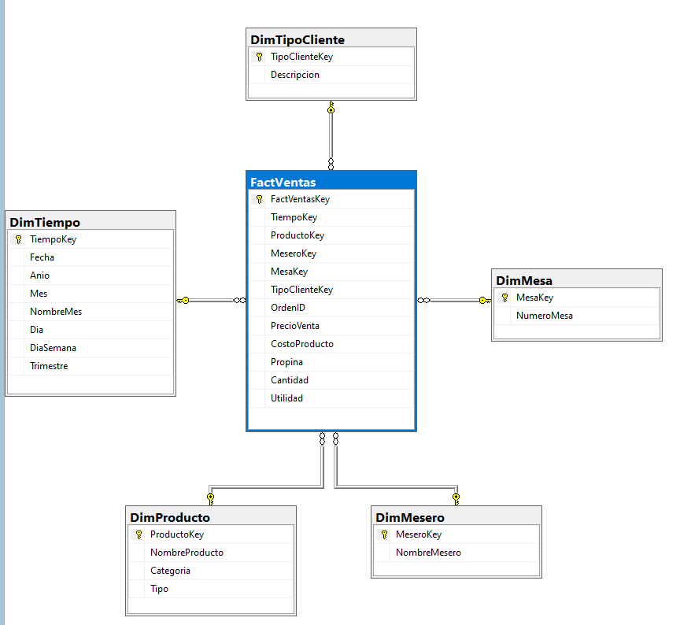

# 📊 Data Warehouse & ETL para Análisis de Restaurante

Este repositorio documenta el diseño, implementación y poblamiento de un Data Warehouse (DW) utilizando Microsoft SQL Server y SQL Server Integration Services (SSIS), enfocado en el análisis de ventas y rendimiento de un restaurante.

## 🎯 Objetivo del Proyecto

Consolidar los datos transaccionales en una estructura analítica optimizada para responder preguntas de negocio:
*   ¿Cuáles son los productos más vendidos por categoría?
*   ¿Qué meseros generan mayores utilidades y reciben más propinas?
*   ¿Cómo se distribuyen las ventas según el tipo de cliente temporalmente?

## 🏗️ Arquitectura y Modelado Dimensional

Se implementó un **Modelo en Estrella**, centralizando las métricas de negocio en una tabla de hechos, rodeada de dimensiones descriptivas.

### Esquema de la Base de Datos (`DW_Restaurante`)

*   **`FactVentas` (Tabla de Hechos):** Almacena `PrecioVenta`, `CostoProducto`, `Propina`, `Cantidad` y `Utilidad`.
*   **Dimensiones:** `DimProducto`, `DimMesero`, `DimMesa`, `DimTipoCliente`, y `DimTiempo`.

**Diagrama Entidad-Relación del DW:**

## ⚙️ Proceso ETL (Extract, Transform, Load)

El flujo de datos desde los orígenes hasta el Data Warehouse se automatizó mediante **SSIS**. En los archivos adjuntos se incluyen los paquetes `.dtsx` demostrando el flujo de control y de datos.

## 📂 Contenido del Repositorio

*   `script_creacion_dw_restaurante.sql`: Script T-SQL con la definición del esquema del Data Warehouse.
*   `Restaurante ETL.zip`: Proyecto completo de SSIS.
*   `Aporte_docmuento de procesos.pdf`: Documentación exhaustiva detallando paso a paso la creación del ETL y configuración del cubo OLAP.

## 💼 Valor Profesional

Este proyecto demuestra competencias clave para roles de **Data Engineer** y **BI Developer**:
1.  **Modelado de Datos Dimensional:** Diseño de arquitecturas OLAP.
2.  **Desarrollo ETL:** Uso de SSIS para integrar y limpiar datos.
3.  **Documentación Técnica:** Registro claro de procesos técnicos complejos.
